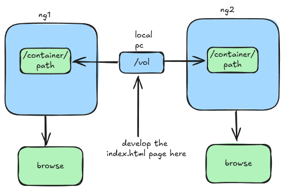

## Parallel mounting  

- no dockerfile will be used here
- make a folder named `vol` ; this folder will work as the storage of the containers 
- now make a compose file
- we need to run 2 services
	- both will be nginx container
- 1st nginx container named ng1 will be exposed on 9090
- 2nd nginx container named ng2 will be exposed on 8080
- now mount the vol folder of your local pc,to the nginx containers
- **which folder to mount inside of nginx container?**
	- the folder contains the index.html file
**Output:**
- develop index.html page in the mounted /vol directory
- you will see both containers will reflect live reflection of your code changes on the web browser