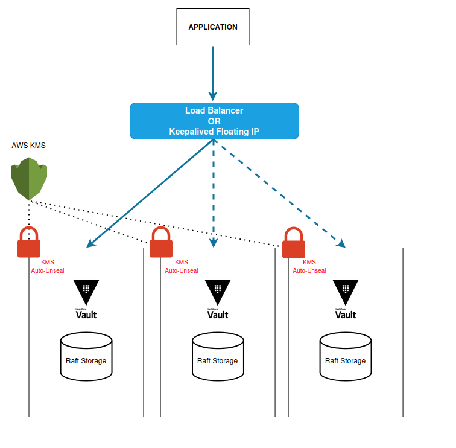
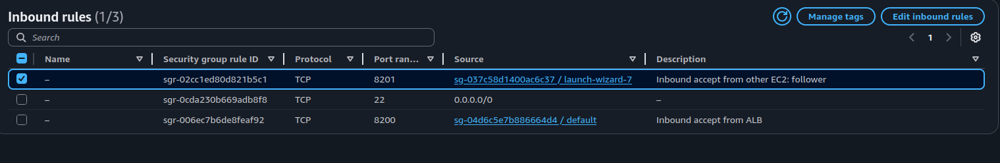
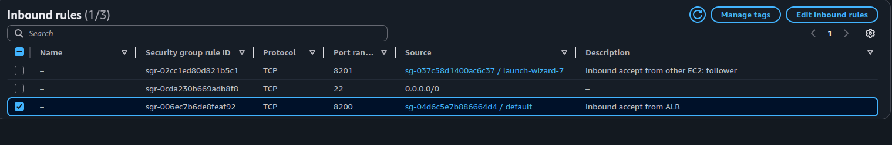

# Vault Installation Guide

## Steps:

### 1. Authenticate with AWS
- use cmd
	`aws configure`

### 2. Create KMS Key For Vault Unsealing Process
```
aws kms create-key \
  --description "My KMS Key for encryption" \
  --key-usage ENCRYPT_DECRYPT \
  --origin AWS_KMS \
  --tags TagKey=Name,TagValue=test
```
name it
```
aws kms create-alias \
  --alias-name alias/vault-unseal-key \
  --target-key-id f79404************91c3cfac3
```

### 3. Create IAM Policy & Role To Use This KMS Key
- update `vault-kms-unseal-policy.json` file and add your
	- aws account id
	- kms key id

- Create Policy
```
aws iam create-policy \
  --policy-name VaultKMSUnsealPolicy \
  --policy-document file://vault-kms-unseal-policy.json
```
- Create Role
```
aws iam create-role \
  --role-name VaultEC2UnsealRole \
  --assume-role-policy-document file://ec2-trust-policy.json
```
- Attach Role With Policy
```
aws iam attach-role-policy \
  --role-name VaultEC2UnsealRole \
  --policy-arn arn:aws:iam::137440810107:policy/VaultKMSUnsealPolicy
```
- Create instance profile
```
aws iam create-instance-profile \
  --instance-profile-name VaultEC2InstanceProfile
```
- Add role to instance profile
```
aws iam add-role-to-instance-profile \
  --instance-profile-name VaultEC2InstanceProfile \
  --role-name VaultEC2UnsealRole
```
### 4. Create Vault EC2 Instances in `each ec2's`
- Vault-1
- Vault-2
- Vault-3

**AMI**: Ubuntu Server 24.04 LTS (HVM)
**Architecture**: 64-bit(x86)

**User Data:**
```
#!/bin/bash
# to uinzip vault installation file
apt-get install -y unzip

USER="vault"
COMMENT="Hashicorp vault user"
GROUP="vault"
HOME="/srv/vault"

# add vault user and group
sudo addgroup --system ${GROUP} >/dev/null
sudo adduser \
  --system \
  --disabled-login \
  --ingroup ${GROUP} \
  --home ${HOME} \
  --no-create-home \
  --gecos "${COMMENT}" \
  --shell /bin/false \
  ${USER}  >/dev/null

# download vault
cd /opt/ && sudo curl -o vault.zip https://releases.hashicorp.com/vault/1.13.1/vault_1.13.1_linux_amd64.zip

sudo unzip vault.zip
sudo mv vault /usr/local/bin/

mkdir -pm 0755 /etc/vault.d
sudo chown -R vault:vault /etc/vault.d

sudo mkdir /vault-data
sudo chown -R vault:vault /vault-data

# sudo mkdir -p /logs/vault/

mkdir -pm 0755 /opt/vault
chown vault:vault /opt/vault
chown vault:vault /usr/local/bin/vault

cat << EOF > /lib/systemd/system/vault.service
[Unit]
Description=Vault Agent
Requires=network-online.target
After=network-online.target
[Service]
Restart=on-failure
PermissionsStartOnly=true
ExecStartPre=/sbin/setcap 'cap_ipc_lock=+ep' /usr/local/bin/vault
ExecStart=/usr/local/bin/vault server -config /etc/vault.d
ExecReload=/bin/kill -HUP $MAINPID
KillSignal=SIGTERM
User=vault
Group=vault
[Install]
WantedBy=multi-user.target
EOF
```

### 5. Attach Role to EC2 Instances

### 6. Prepare `vault.hcl` file 
- add ec2's own private ip on
	- `cluster_addr`
	- `api_addr`
- add other 2 ec2's private ip on 
	- `leader_api_addr`
- update kms key id

### 6. Modify Security Group Rule:
- all ec2 instances/vault instances(master/follower) should be able to call each other on port 8201
- we can put, all ec2's in same security group. then reference that SG to allow 8201 port internally.

### 7. SSH Into EC2's
### 8. Input data in vault.hcl file in `each ec2's`
- Get the command from the `vault.hcl` file
```
cat << EOF > /etc/vault.d/vault.hcl
storage "raft" {
  path    = "/opt/vault"
  node_id = "vault-node-3"
  ....
  ....
  ....
EOF
```

### 9. configure and start vault in `each EC2's`
```
sudo chmod 0664 /lib/systemd/system/vault.service
systemctl daemon-reload
sudo chmod -R 0644 /etc/vault.d/*
chmod 0755 /usr/local/bin/vault

cat << EOF > /etc/profile.d/vault.sh
export VAULT_ADDR=http://127.0.0.1:8200
export VAULT_SKIP_VERIFY=true
EOF

systemctl enable vault
systemctl start vault
export VAULT_ADDR=http://127.0.0.1:8200
```

### 10. Check 
- in each EC2's execute `vault status`
- output should be
```
Key                      Value
---                      -----
Recovery Seal Type       awskms
Initialized              false
Sealed                   true
...
...
Version                  1.13.1
Storage Type             raft
HA Enabled               true
```

### 11. Initiate Cluster
- Only on master node execute
`vault  operator  init`
- note down the Root Token `hvs.CP*****5PLhDrl`
### 12. Check
- on master node 
`vault operator raft list-peers`
```
Key                      Value
---                      -----
Recovery Seal Type       shamir
Initialized              true
Sealed                   false
...
...
Raft Applied Index       37
```
- check follower nodes
	- `vault login hvs.CP*********LhDrl`
	- ``vault operator raft list-peers``

### 13. Check new master selection
- just stop vault on master node, to check if new master is elected

### 14. Add Load balancer to balancer traffic to each instance
- **Create a Target Group**
	- health check path `/v1/sys/health`
	- target port `8200`

**For faster failover**
- Healthy threshold : 2
- Timeout : 2
- Interval : 5
- **Create a Load Balancer**
	- ALB
	- listener 80
### 15. Secure LB communication
- we can only allow lb -> ec2 communication
- allow 8022 port from only lb security group

## Common Scenarios:
If `vault operator raft list-peers` outputs:
```
Error reading the raft cluster configuration: Error making API request.
URL: GET http://127.0.0.1:8200/v1/sys/storage/raft/configuration
Code: 403. Errors:
* permission denied
```
Then you must login again:
`vault login hvs.*********O5PLhDrl`
